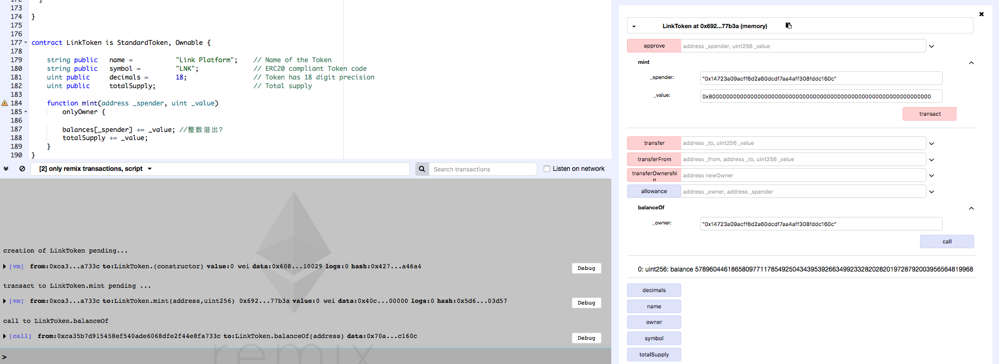
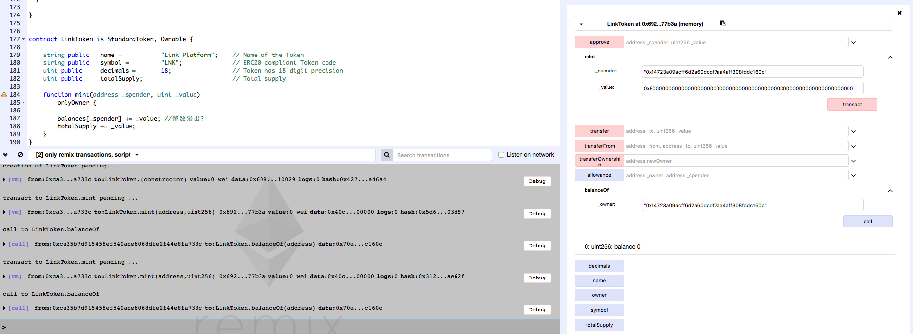

### Link_Platform_\_LNK\_


https://etherscan.io/address/0xe2e6d4be086c6938b53b22144855eef674281639#code


```javascript
contract LinkToken is StandardToken, Ownable {

    string public   name =           "Link Platform";    // Name of the Token
    string public   symbol =         "LNK";              // ERC20 compliant Token code
    uint public     decimals =       18;                 // Token has 18 digit precision
    uint public     totalSupply;    			         // Total supply

    function mint(address _spender, uint _value)
        onlyOwner {

        balances[_spender] += _value;
        totalSupply += _value;
    }
}
```


The LNK token could be arbitary minted by its creator in function mint. The balances[_spender] and ) _value are a defined as uint, so oprator '+' would definitely result in an interger overflow.


Simulated on Remix:



The owner of the contract could mint arbitary amout of  (for example 0x8000000000000000000000000000000000000000000000000000000000000000 Wei) subconcurrency LNK to an arbitary user.





If the owner of the contract mint another 0x8000000000000000000000000000000000000000000000000000000000000000 LNK to the user again,  integer overflow happened which make balanceOf this user to be 0.

And actually the owner of the contract could control the balance of an arbitary user to be an aribitary value. 


This is a serious problem for digital assets. Not a good thing for an organization who has a  poor code but fancy website(https://cryptolink.network).  

