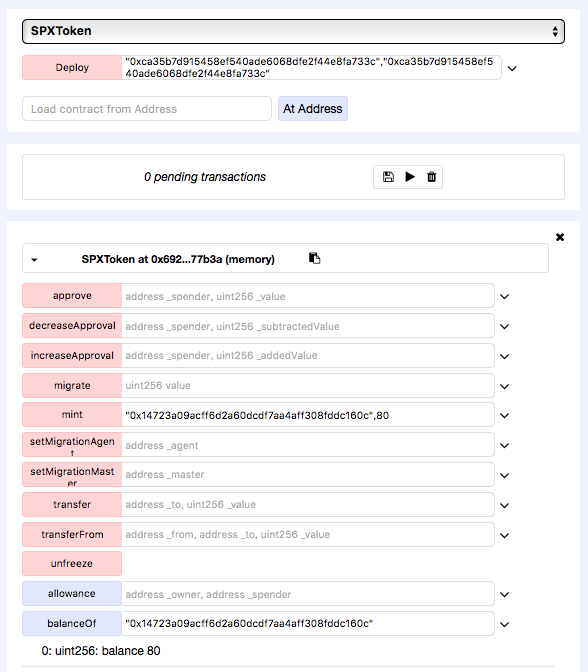
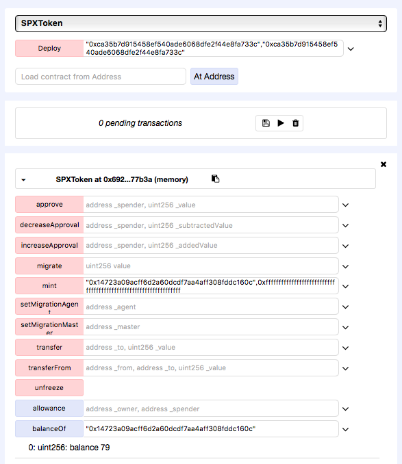

### SP8DE Token(SPX)

https://etherscan.io/address/0x05aaaa829afa407d83315cded1d45eb16025910c#code

```javascript
  function mint(address holder, uint value) public {
    require(msg.sender == ico);
    require(value > 0);
    require(totalSupply + value <= TOKEN_LIMIT);

    balances[holder] += value;
    totalSupply += value;
    Transfer(0x0, holder, value);
  }
```

TOKEN_LIMIT is defined as
```javascript
uint public constant TOKEN_LIMIT = 8888888888 * (1e18);
```

The SPX token could be arbitary minted by contract owner in function mint. There exists a useless check `require(totalSupply + value <= TOKEN_LIMIT)` which could be bypassed via interger overflow:

    totalSupply : 8888888888000000000000000000
    value : 0xffffffffffffffffffffffffffffffffffffffffffffffffffffffffffffffff
    totalSupply + value =  8888888887999999999999999999 < TOKEN_LIMIT


`balances[holder]` and `value` are defined as uint, so oprator '+' would result in an interger overflow too.

    balance[someuser] : 80
    value : 0xffffffffffffffffffffffffffffffffffffffffffffffffffffffffffffffff
    totalSupply + value =  79

Through this vulnerability, the minted tokens could be arbitrarily retrieved by the contract owner.

Simulated on Remix:






This is a serious problem for digital assets.


### Similar Vulnerabilities

Other tokens found vulnerable by us are listed below.

##### SpadeICO
https://etherscan.io/address/0xfdb3c07c25f5a6879cc8b00685ed1a080c59615e#code
```javascript
  function mint(address holder, uint value) public {
    require(msg.sender == ico);
    require(value > 0);
    require(totalSupply + value <= TOKEN_LIMIT);

    balances[holder] += value;
    totalSupply += value;
    Transfer(0x0, holder, value);
  }
```

##### MoxyOnePresale 
https://etherscan.io/address/0x74fa9aa30b1b35c8f5bdb76f079c2624fc0b6498#code
```javascript
  function mint(address _holder, uint _value) external {
    require(msg.sender == presale);
    require(_value > 0);
    require(totalSupply + _value <= TOKEN_LIMIT);

    balances[_holder] += _value;
    totalSupply += _value;

    Transfer(0x0, _holder, _value);
  }
 ```

##### GVToken Genesis Vision (GVT)
https://etherscan.io/address/0x103c3a209da59d3e7c4a89307e66521e081cfdf0#code
```javascript
    function mint(address holder, uint value) {
        require(msg.sender == ico);
        require(value > 0);
        require(totalSupply + value <= TOKEN_LIMIT);

        balances[holder] += value;
        totalSupply += value;
        Transfer(0x0, holder, value);
    }
```

##### Etherty Token (ETY)
https://etherscan.io/address/0x0661f731f7f442a4147b87af5e77a9ecc7ed744e#code
```javascript
    function mint(address _holder, uint _value) external {
        require(msg.sender == ico);
        require(_value != 0);
        require(totalSupply + _value <= TOKEN_LIMIT);

        balances[_holder] += _value;
        totalSupply += _value;
        emit Transfer(0x0, _holder, _value);
    }
```

##### Bitotal (TFUND)
https://etherscan.io/address/0xb334d6617dbe12fa75cc286436b7d20f8b04a4cb#code
```javascript
  function mintTokens(address _to, uint256 _amount) private {
    require((totalSupply + _amount) <= maxSupply);
    balances[_to] += _amount;
    totalSupply += _amount;
    emit Transfer(0x0, _to, _amount);
  }
```

##### SpadePreSale
https://etherscan.io/address/0x50ca2de80e803bf4b00f188545bca959540c5582#code
```javascript
  function mint(address holder, uint value) {
    require(msg.sender == preSale);
    require(value > 0);
    require(totalSupply + value <= TOKEN_LIMIT);

    balances[holder] += value;
    totalSupply += value;
    Transfer(0x0, holder, value);
  }
```

##### SP8DE PreSale Token (DSPX)
https://etherscan.io/address/0x30dda19c0b94a88ed8784868ec1e9375d9f0e27c#code
```javascript
  function mint(address holder, uint value) {
    require(msg.sender == preSale);
    require(value > 0);
    require(totalSupply + value <= TOKEN_LIMIT);

    balances[holder] += value;
    totalSupply += value;
    Transfer(0x0, holder, value);
  }
```

#####  ATLANT (ATL)
https://etherscan.io/address/0x78b7fada55a64dd895d8c8c35779dd8b67fa8a05#code
```javascript
  function mint(address _holder, uint _value) external {
    require(msg.sender == ico);
    require(_value != 0);
    require(totalSupply + _value <= TOKEN_LIMIT);

    balances[_holder] += _value;
    totalSupply += _value;
    Transfer(0x0, _holder, _value);
  }
```
